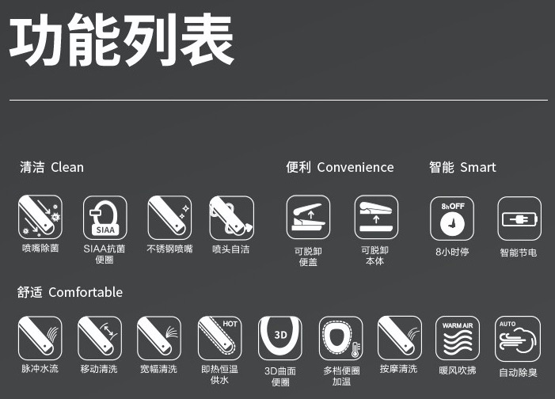
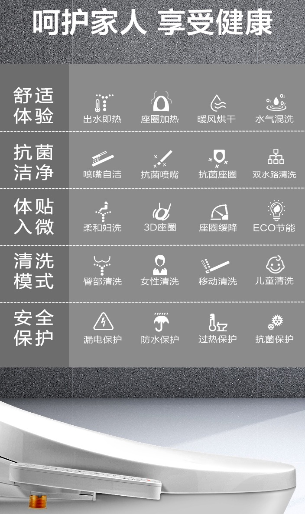
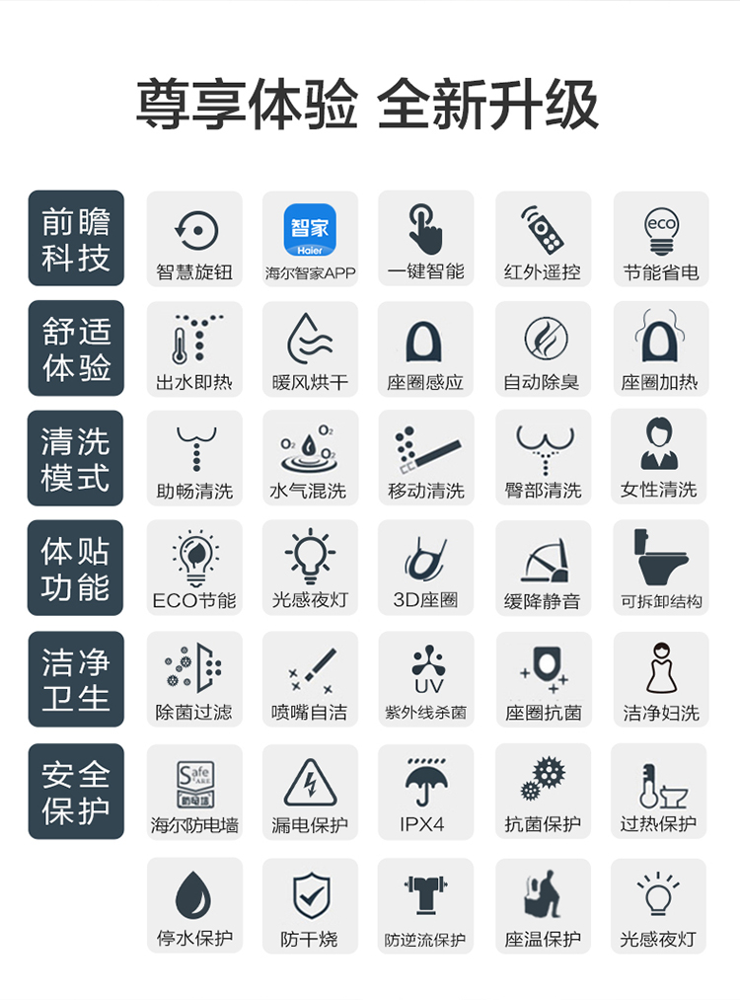

# 智能马桶盖的功能

* 智能马桶盖 功能
  * 三类
    * 基础功能
      * `温水清洗`
      * `座圈加热`
      * `除臭净味`
      * `暖风烘干`
      * `阻尼缓降`
      * `一键拆卸`
    * 进阶功能
      * 多种清洗模式
        * 移动洗、宽幅洗、儿童洗、气泡洗、脉冲洗、冷热洗、按摩洗等等
          * 往往对应着：`双管路`=`双水路` = `臀洗`+`妇洗`
      * 暖风烘干：可调节档位，有双风道立体烘干
      * 座圈加热
        * 加热方式
          * 储热、速热
            * 储热式和速热式的缺点比较多，耗电量大，水箱会滋生细菌，一般不建议选择
          * 即热式
            * 最好还是选择即热式的
        * 座圈加热能够感应加热
      * 感应开合
      * 操作系统
    * 高端功能
      * 除臭净味：支持活性炭、硅藻泥进行除臭
      * 感应夜灯
      * 记忆功能
      * 智能节电
      * 数据监测
      * 智能联网
      * APP操控
      * 语音控制

## 智能马桶盖的常见功能的汇总列表

* 常见功能的汇总列表
  * 
  * 
  * 
