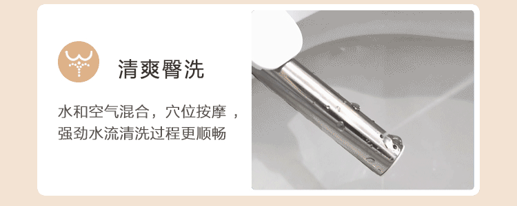
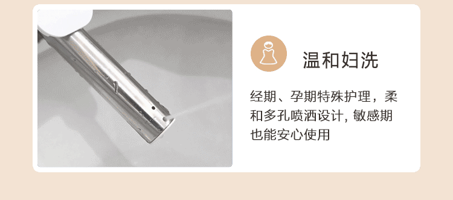
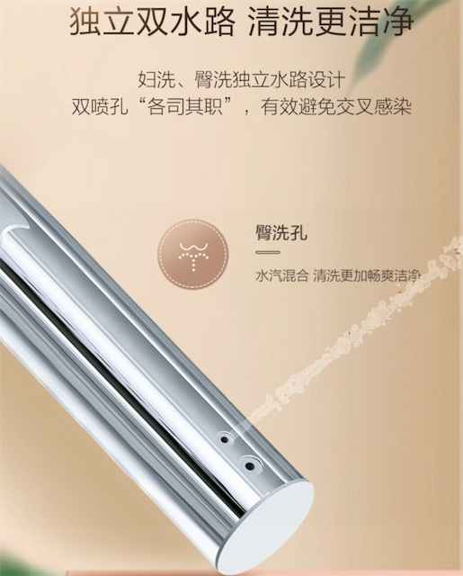
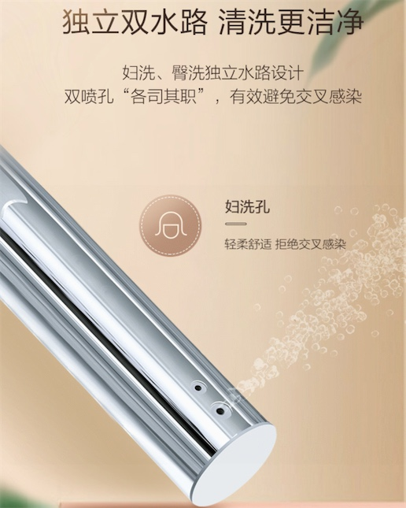
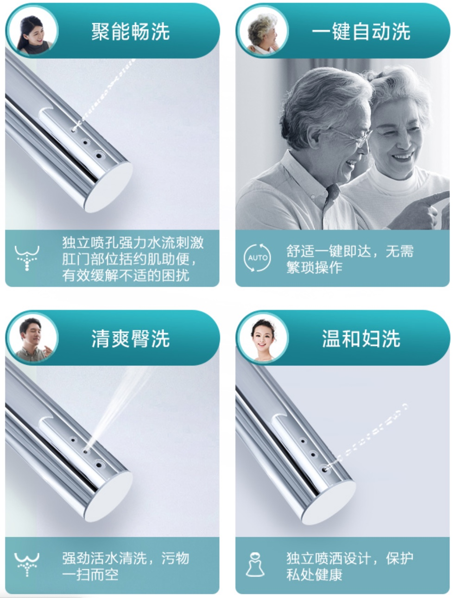
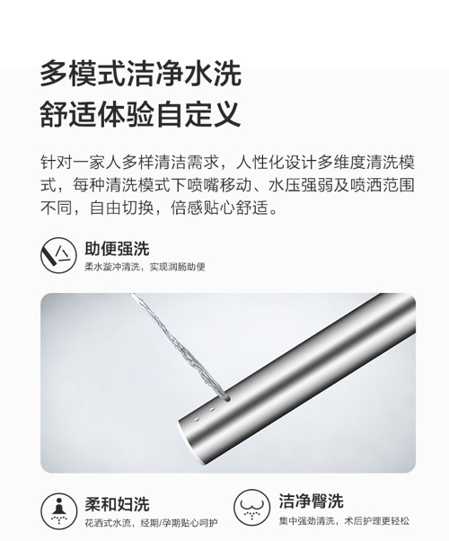

# 多水路清洗

## `双水路清洗`=`臀洗`+`妇洗`

* 双水路清洗
  * 对比1
    * **清爽臀洗**：水和空气混合，穴位按摩，强劲水流清洗过程更顺畅
      * 
    * **温和妇洗**：经期、孕期特殊护理，柔和多孔喷洒设计，敏感期也能安心使用
      * 
  * 对比2
    * **清爽臀洗**：水量大，冲击力强
      * 
    * **温和妇洗**：水量柔和
      * 

## 三孔

* 有些是 三孔
  * 聚能畅洗 + 清爽臀洗 + 温和妇洗
    * 
  * 助便强洗 + 柔和妇洗 + 清洁臀洗
    * 多模式清洁水洗，舒适体验自定义
      * 
