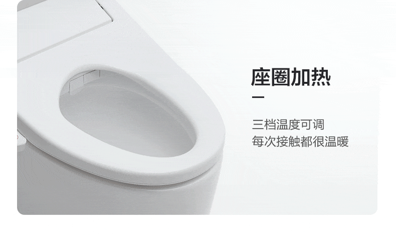
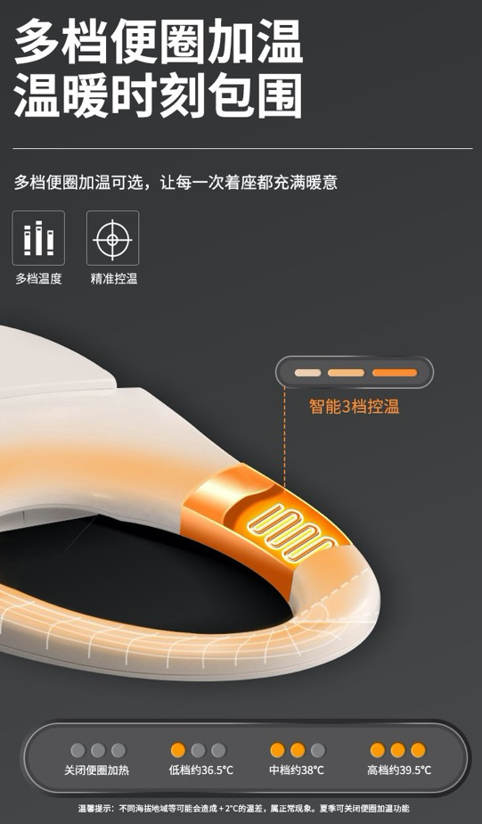
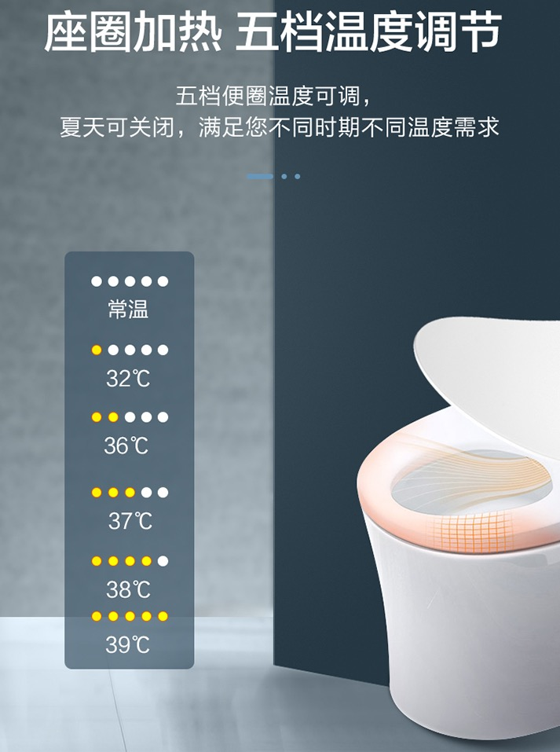
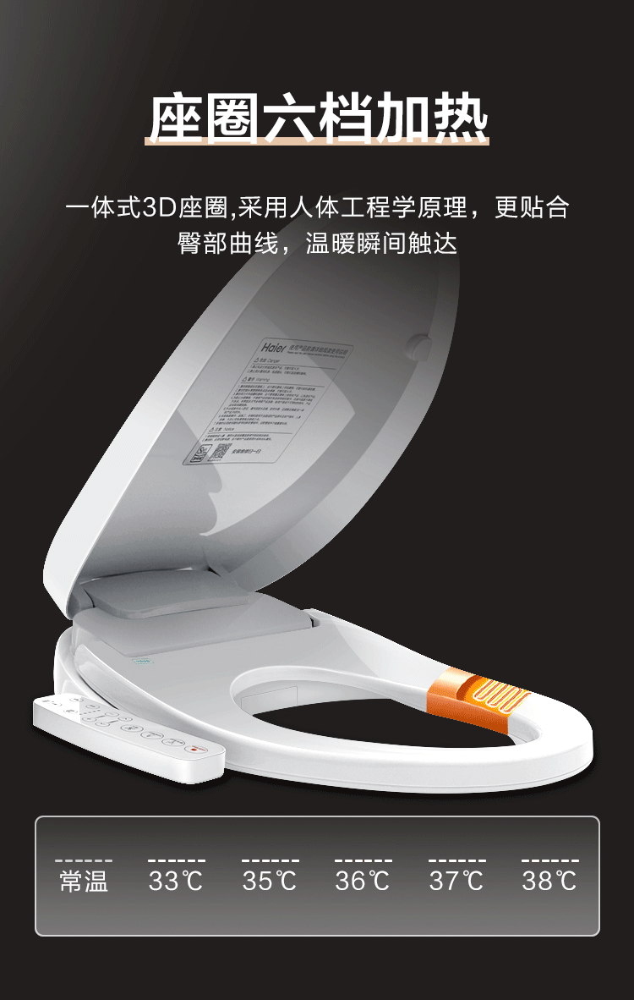
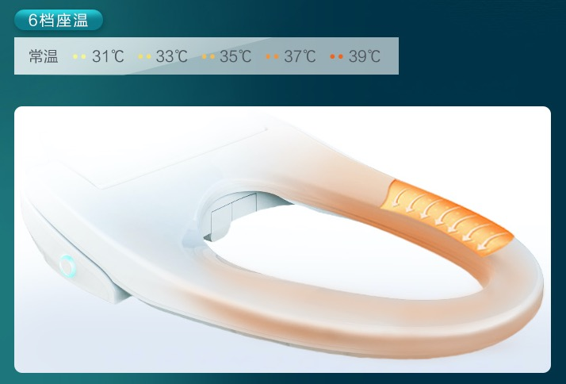

# 座圈加热

* 座圈加热 = 座温加热
  * 支持不同档的温度调节
    * 比如
      * 3挡
        * 三挡温度可调，每次接触都很温暖
          * 
        * 多挡便圈加温，温暖时刻包围
          * 
      * 5挡
        * 五档座温调节，适应不同季节变化
          * 
        * 座圈加热，五档温度调节
          * 
      * 6挡
        * 座圈6挡加热
          * 
        * 6挡座温
          * 
