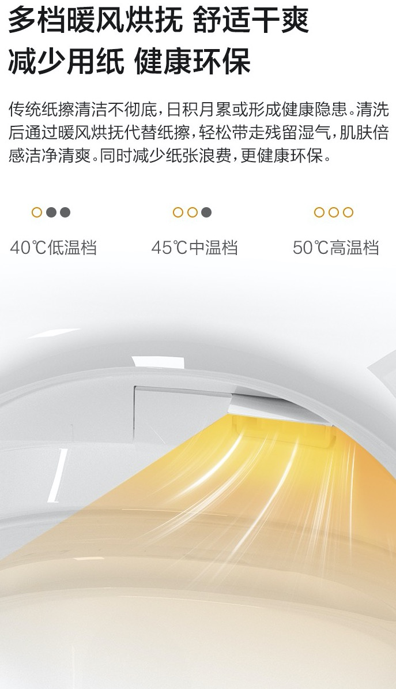
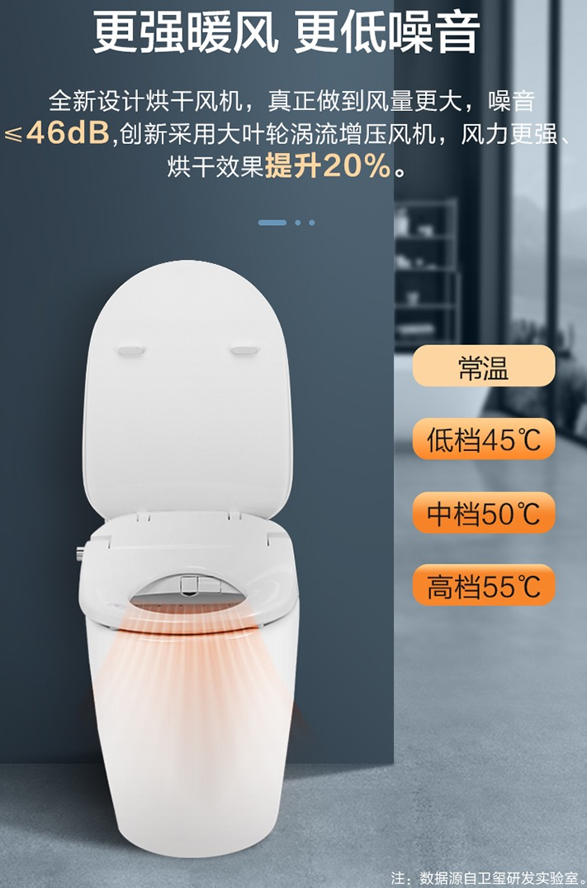
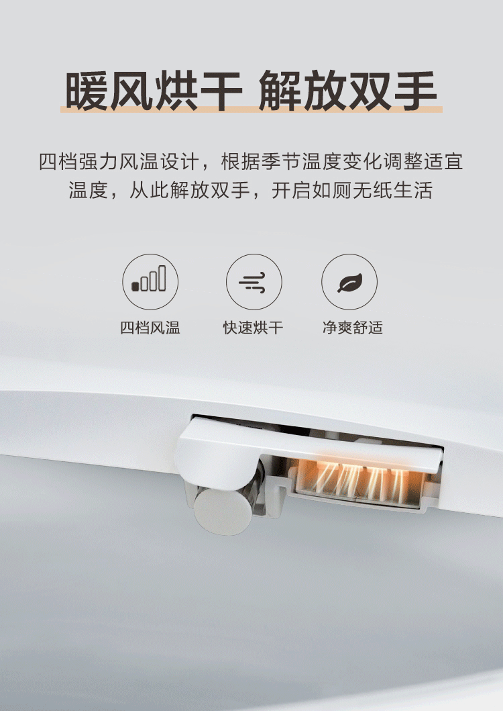
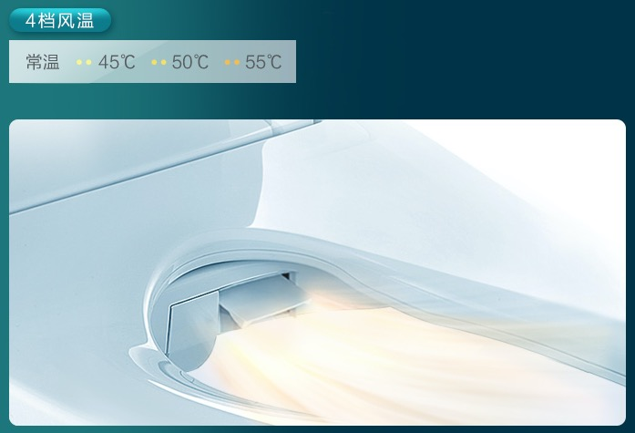
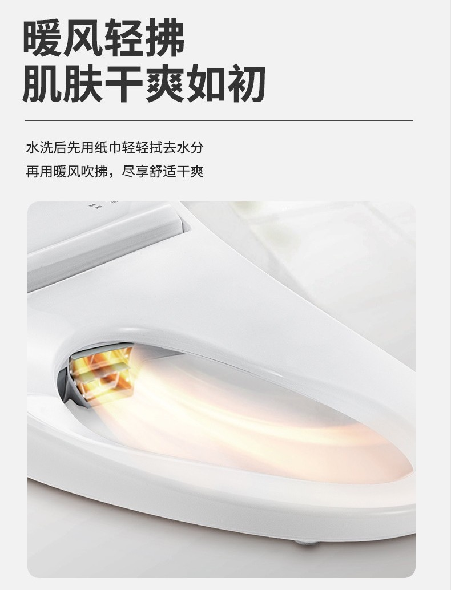

# 暖风烘干

* 暖风烘干
  * 作用：开启后，吹暖风，吹干屁屁
  * 使用方式：先用（一两张）纸擦干屁屁，再用暖风烘干，彻底烘干屁屁
  * 注意：实际使用中，完全靠暖风彻底烘干屁屁，而完全不用纸，其实很难实现
    * 毕竟暖风的功率不会太高，很难在短期内迅速彻底烘干
  * 举例
    * 3挡
      * 多挡暖风烘抚，舒适干爽，减少用纸，健康环保
        * 
      * 更强暖风，更低噪音
        * 
    * 4挡
      * 暖风烘干，解放双手
        * 
      * 4挡风温
        * 
    * 其他
      * 暖风清拂，肌肤干爽如初
        * 
