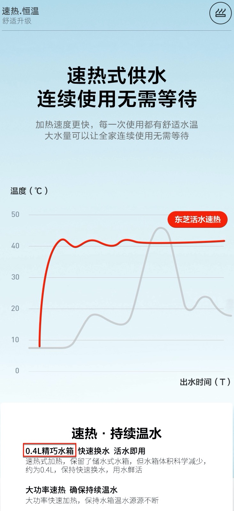
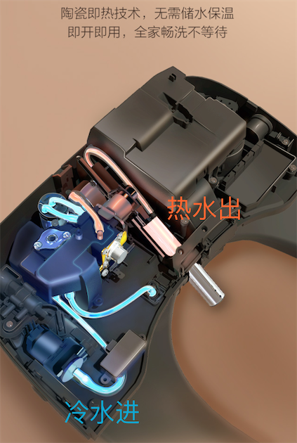
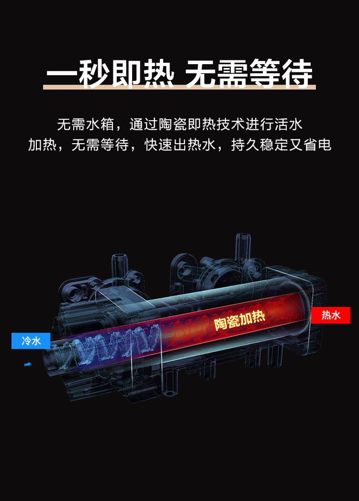
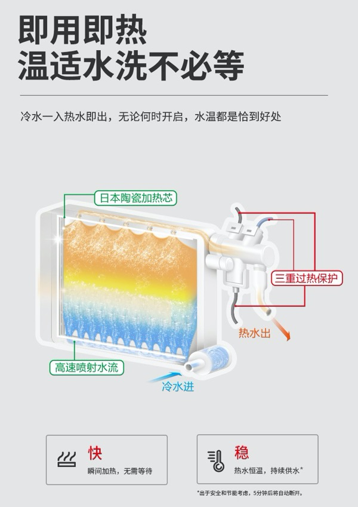
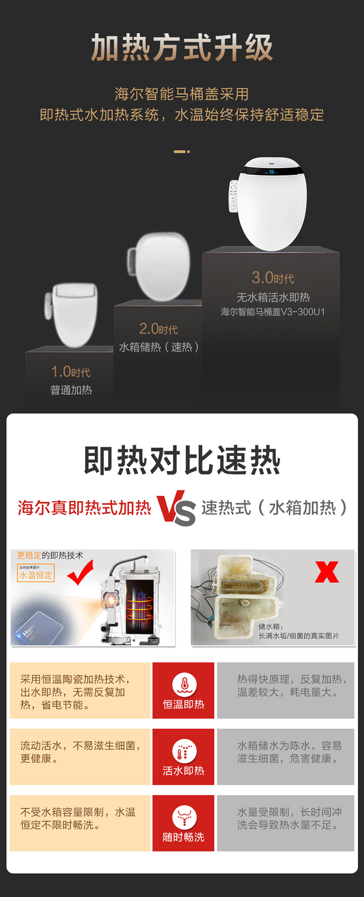
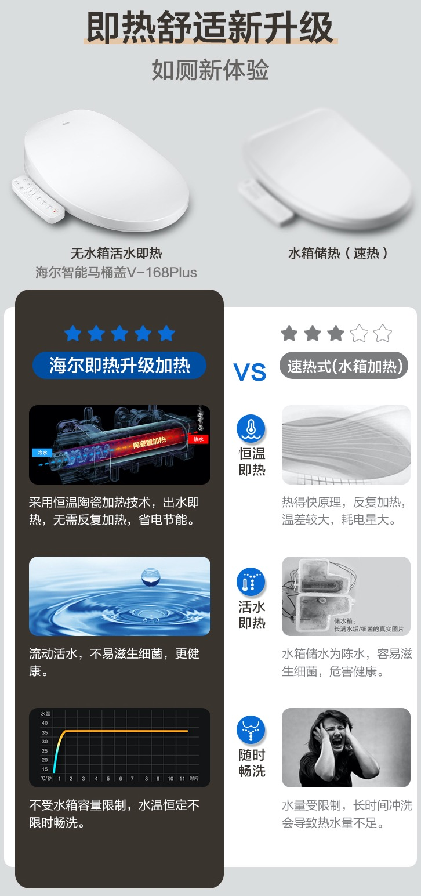
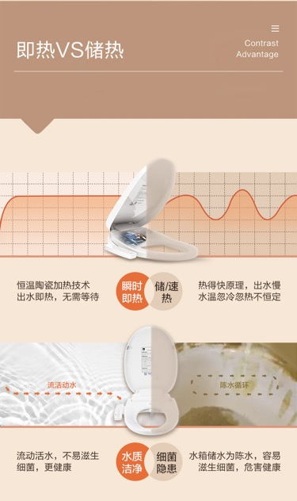
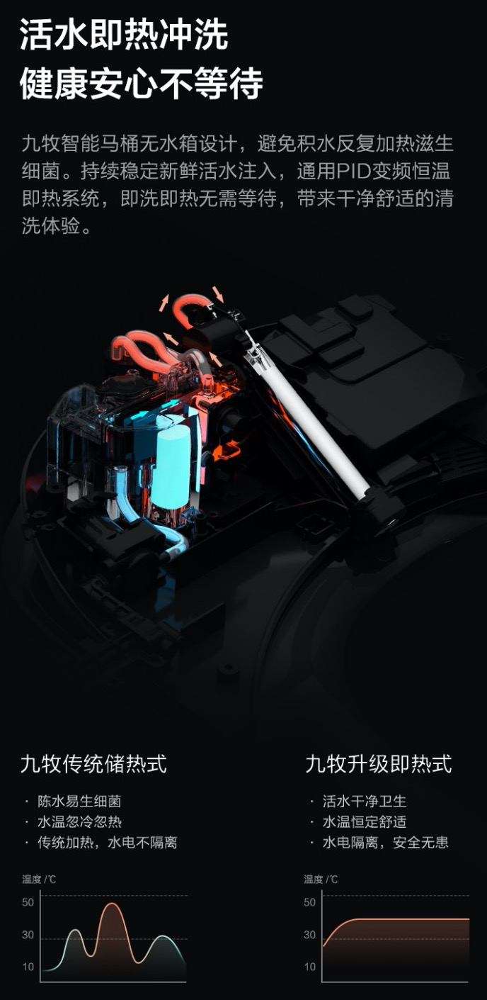

# 加热方式

对于喷出的热水的：

* 常见加热方式
  * **储热式**：最老的，带水箱，热得快的原理一样去加热，加热慢
  * **速热式**：普通的，带小水箱(常见容量`0.4L`)，也要加热一小会后，才有热水
  * **即热式**：最好的，不带水箱，立即加热出热水。一般用**陶瓷加热芯片**实现实时加热
* 对比=结论
  * 即热式 >> 速热式 > 储热式

## 速热式

* 举例
  * 速热式供水，连续使用无需等待
    * 

## 即热式

* 举例
  * 陶瓷即热技术实现立即加热效果，冷水进，热水出
    * 
  * 一秒即热，无需等待
    * 
  * 即用即洗，温适水洗不必等
    * 

## 加热方式对比

* 即热 vs 储热
  * 解释1
    * 
  * 解释2
    * 
  * 解释3
    * 
    * 
  * 解释4
    * 
