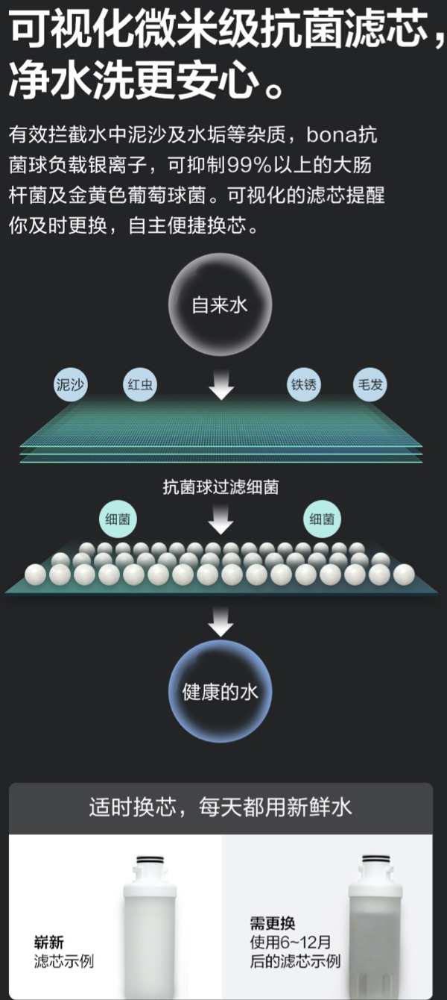
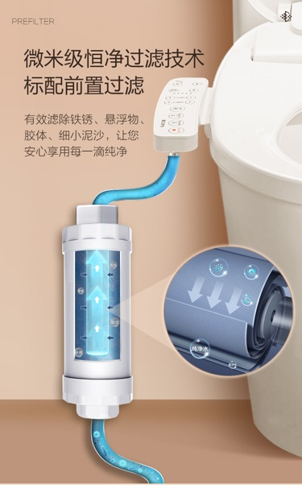
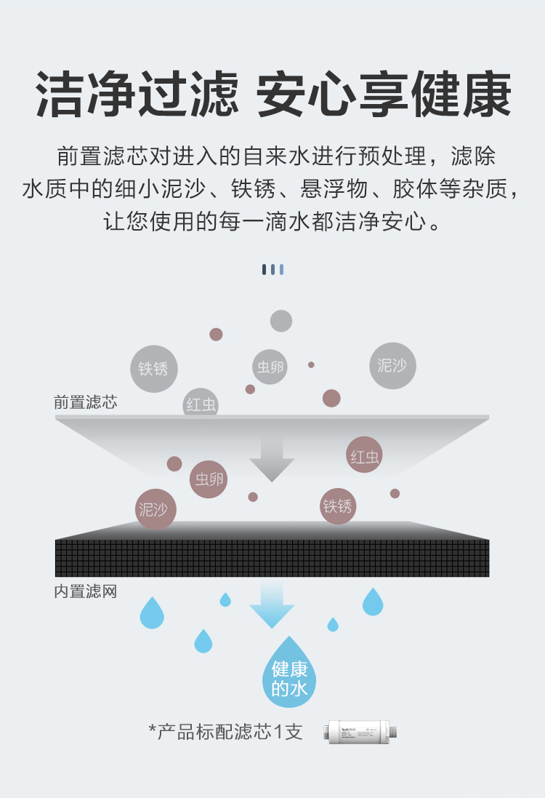
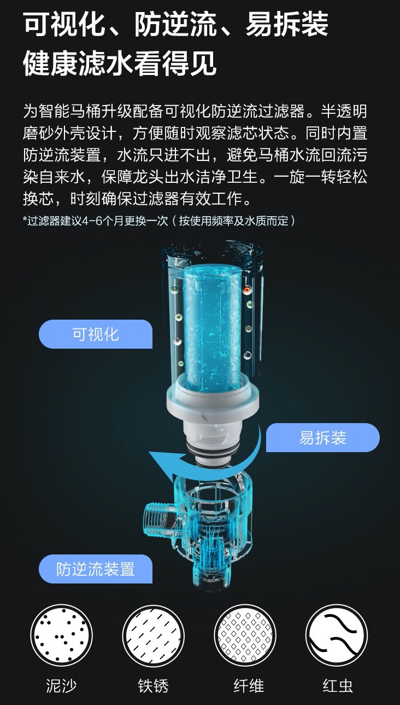
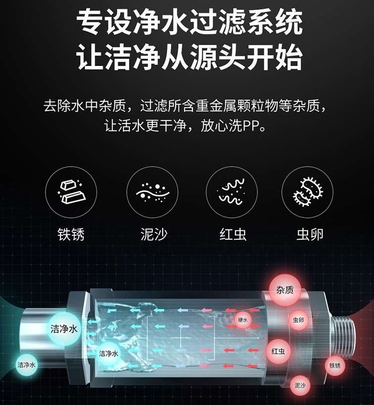

# 水质过滤

* 水质过滤
  * 前置
    * `前置过滤`=`前置滤芯`
      * 作用：对于输入的自来水，进行过滤，去除杂质和病菌，确保冲洗你的水是**干净和卫生**的
      * 多长时间换一次：平均 **4~12个月**
  * 内置

## 前置滤芯

* 抗菌滤芯
  * 
* 前置过滤
  * 
* 前置滤芯
  * 
* 前置滤芯
  * 可视化 + 防逆流 + 易拆装
    * 
* 净水过滤系统
  * 
