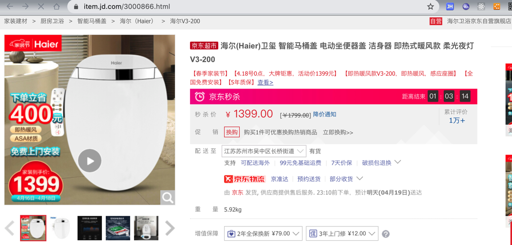

# 如何选购智能马桶盖

## 价格

目前200-4000之间比较主流

* 200-500，只是个加热板，暖屁屁，不冲水
* 800-1500，中低端价位，暖垫、温水冲洗、暖风烘干、除臭等，适合普通家庭入门
* 1500-2500，中端价位，松下、TOTO的当打区间，功能丰富，品质可靠，适合轻享生活
* 2500-4000，高端价位，一般带遥控，智能功能，记忆功能等，高端生活的标配

## 如何选择

个人推荐：

* 价格：800~1500
  * 性价比相对很高
* 功能
  * 一定要有
    * 即热式
    * 材质比ABS更好
      * `PP`或`ASA`等
    * 加热
    * 暖风
  * 最好有
    * 材质是相对更好的`ASA`
    * 抗菌
    * 柔和夜灯=夜光照明
    * 水混空气=SPA=节水
  * 可有可无
    * 人体感应
    * 自动除臭
* 可以考虑的产品
  * [海尔 卫玺 V3-200](https://item.jd.com/3000866.html)
    * 

## 200元价位

举例：

* 199元
  * [京东京造 智能马桶盖调温版 单加热盖板 加热加厚缓降坐便盖板 JZF1H](https://item.jd.com/100007766580.html)
    * 

## 1000左右

* 