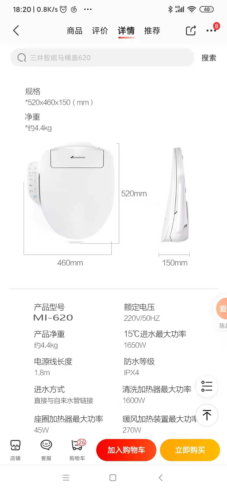
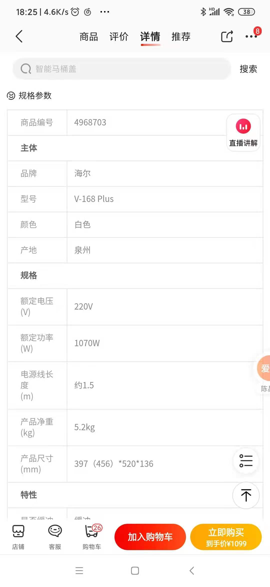
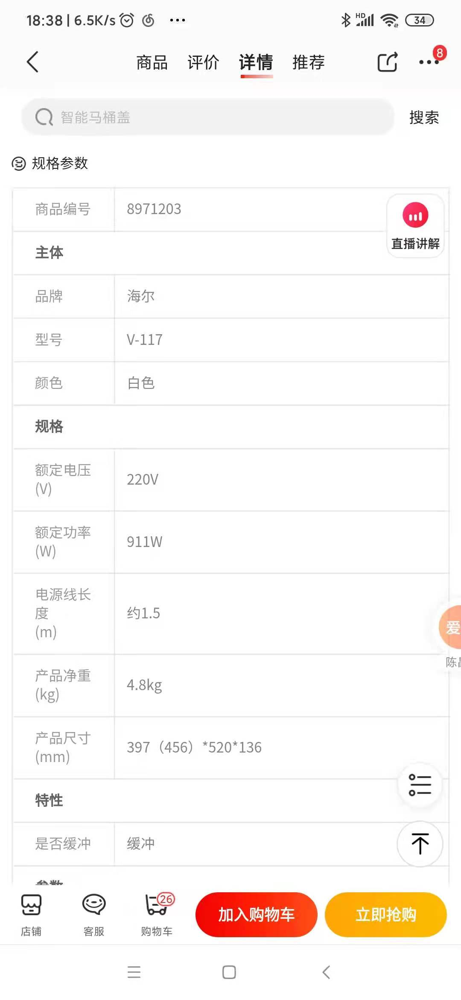
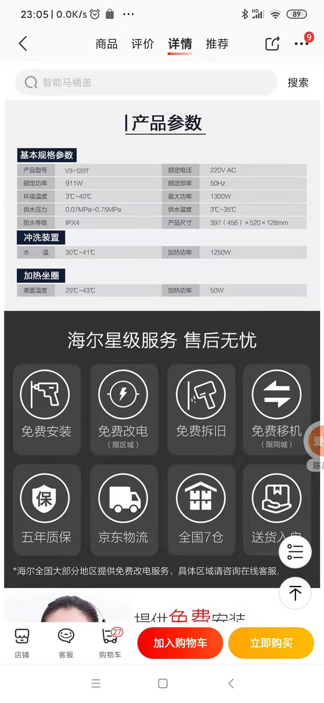
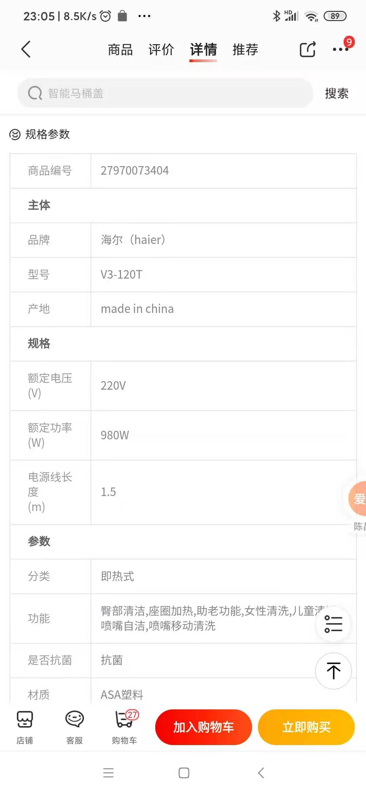
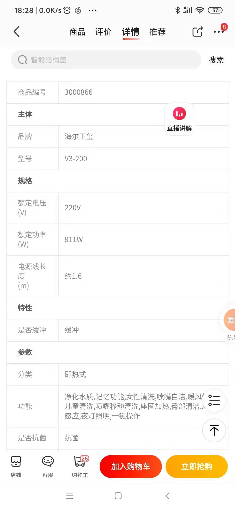
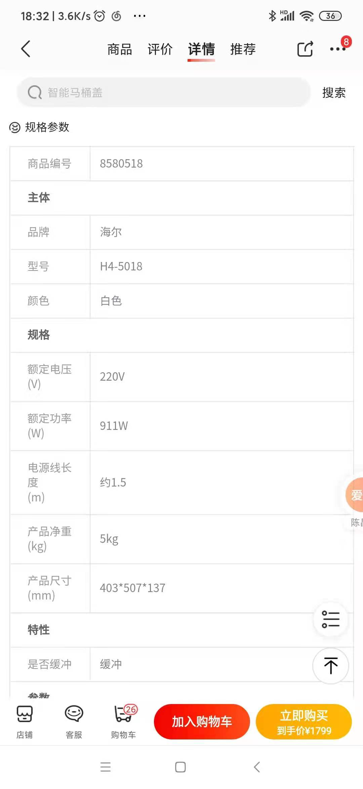

# 不同产品的功率

对于智能马桶盖来说，产品的（额定，最大）功率，对于功能的影响其实比较大。

在有条件的情况下，尽量选购**功率大**（也就更贵）的智能马桶盖。

此处贴出之前对比研究的几款智能马桶盖，查到的带功率参数介绍的情况，供参考和了解：

* 三井 MI 620：清洗加热功率 `1600W`
  * 
* 海尔V168 Plus：额定功率 `1070W`
  * 
* 海尔V117：额定功率 `911W`
  * 
* 海尔V3-120T：额定功率 `911W`
  * 
* 海尔V3-120T：额定功率 `980W`
  * 
* 海尔V3-200：额定功率 `911W`
  * 
* 海尔H4-5018：额定功率 `911W`
  * 
