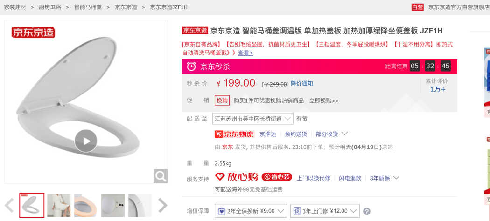

# 不同价位

## 价格

目前200-4000之间比较主流

* 200-500，只是个加热板，暖屁屁，不冲水
* 800-1500，中低端价位，暖垫、温水冲洗、暖风烘干、除臭等，适合普通家庭入门
* 1500-2500，中端价位，松下、TOTO的当打区间，功能丰富，品质可靠，适合轻享生活
* 2500-4000，高端价位，一般带遥控，智能功能，记忆功能等，高端生活的标配

* 选择
  * 低端机（1500元以内），建议选择国产品牌，性价比更高，能够满足基本使用需要
  * 中端机（1500~2500元），同样建议选择国产品牌（惠达、九牧、箭牌、海尔、便洁宝），性价比高，而且功能全面，使用体验会有比较不错的提升
  * 中高端机（2500~4000元），优先考虑进口品牌（东芝、松下、TOTO、科勒、伊奈、美标），功能全面，使用体验好
  * 高端机（4000元以上），优先考虑进口品牌，怎么买都不会差

## 200元价位

举例：

* 199元
  * [京东京造 智能马桶盖调温版 单加热盖板 加热加厚缓降坐便盖板 JZF1H](https://item.jd.com/100007766580.html)
    * 

## 1000左右

* [海尔(Haier)卫玺 V-117](https://item.jd.com/8971203.html)
  * 原价：1099
  * 优惠价：899
    * 

> * 多种清洗模式：移动清洗、妇洗、臀洗
> * 功率：911W
> * 温水方式：即热
> * 暖风烘干：无
> * 除臭功能：无
> 
> 海尔的入门款，价格很低，销量不错，在坐便加热的基础上，带有温水冲洗功能。
> 
> 冲洗有多种模式，温水加热是即热式，算是很良心的配置。由于价格限制，没有暖风、没有除臭。
> 
> 不过依旧很推荐，是这个价位里非常能打的一款产品

## 1400左右

* [东芝（TOSHIBA），T3-83B6](https://item.jd.com/8879817.html)
  * 原价：1999
  * 优惠价：1399
    * 

> * 功率：1150W
> * 温水方式：即热
> * 暖风烘干：有
> * 除臭功能：无
> 
> 附加功能：带遥控，冷热按摩，可拆卸喷头，纳米抗菌坐垫
> 
> 京东的代工产品，典型的互联网产物，价格实惠，也送一个PP棉前置过滤，保护盖子，功能一应俱全
> 
> 这一款是带有可拆卸喷头的（方便清洗），坐垫带有抗菌功能，脏了容易清洁
> 
> 带遥控，带冷热按摩模式，以及多种清洗模式，即热出水

# 1600左右

* [海尔卫玺 V3-200](https://item.jd.com/3000866.html)
  * 原价：1799
  * 优惠价：1399
    * 

> * 功率：911W
> * 温水方式：即热
> * 暖风烘干：有
> * 除臭功能：有
> * 附加功能：多个清洗模式，5档调节水温，带夜光、ECO节能
> 
> 海尔的中端款，外观比较有特点，长辈那一代的非常喜欢这个品牌。功能实在，品质也信得过，售后到位，在东哥家的销量非常高
> 
> 多种清洗模式，水温可以5个档位调节，有夜光功能，也带有前置过滤器，还有个ECO功能，长时间没人使用的时候机器会自动降低能耗，稍微降低座便温度，很人性化，性价比非常高

# 2000元左右

* [飞利浦（PHILIPS），AIB2201/00](https://item.jd.com/100005577848.html)
  * 秒杀价：1799
    * 

> * 功率：956W
> * 温水方式：即热
> * 暖风烘干：有
> * 除臭功能：有
> * 附加功能：6档调节水温，4档暖风，自动排残水，
> 
> 飞利浦的中端款，基本的功能都非常齐全，带前置过滤器，6档调节水温，4档暖风调节，功能丰富，还有个自动排走残留水的功能，保持每次都喷新鲜的水，对健康和卫生更加有保障
> 
> 有除臭，有夜灯，臀洗、妇洗独立水道，两次自清洁，功能完善
> 
> 价格不贵，还送一个500的花洒，实际价值可能在200左右，比较实惠

# 2500元左右

* [科勒KOHLER，K-18649T-0](https://item.jd.com/3849090.html)
  * 优惠价：2694
    * 

> * 功率：1100W
> * 温水方式：即热
> * 暖风烘干：有
> * 除臭功能：有
> * 附加功能：恒动速热，银离子抗菌
> 
> 美国老牌，这个领域的顶尖品牌，高度适配自家的马桶，功能多样，设计高端，广告打的不少
> 
> 这是科勒的入门款，恒动速热式（就是即热）
> * 
> 他们家的盖边是有银离子抗菌技术的，和SASS抗菌大同小异，整体品牌弄的高端，这一款产品功能常规，性价比尚可
