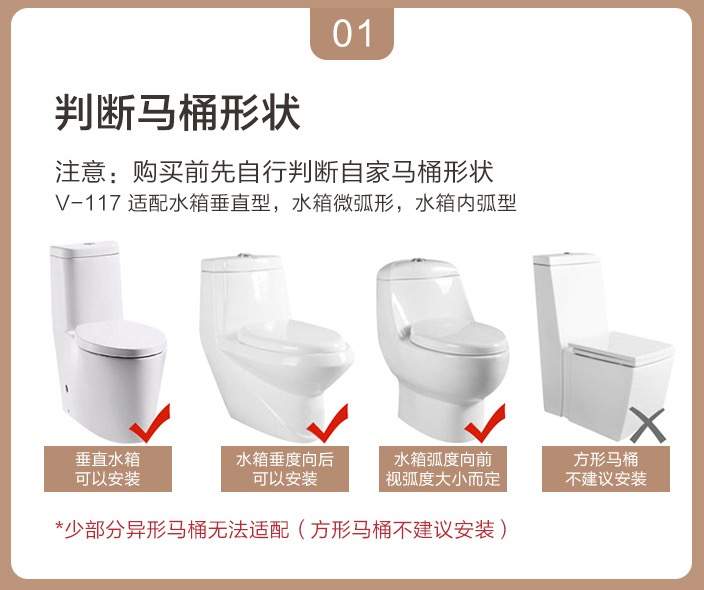
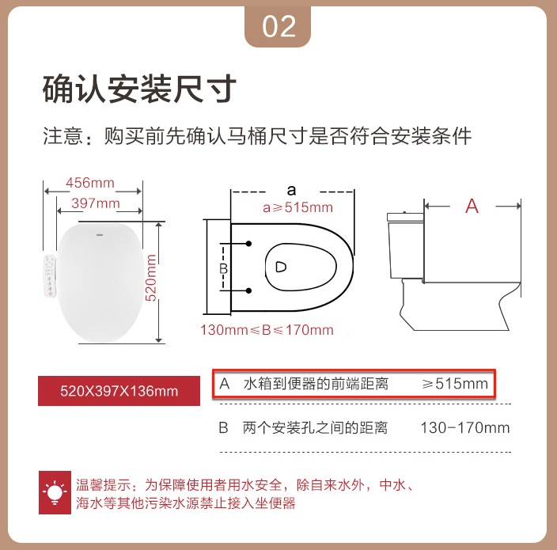
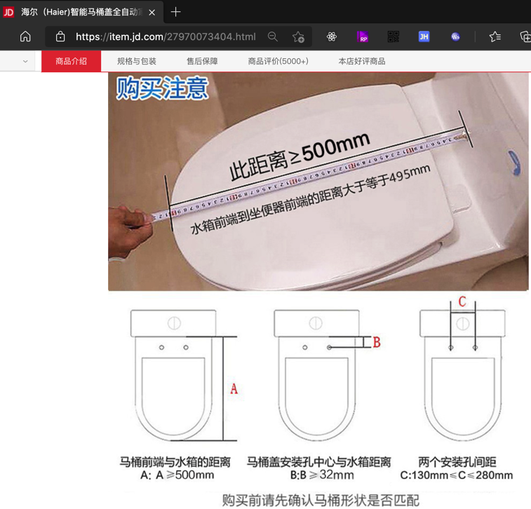
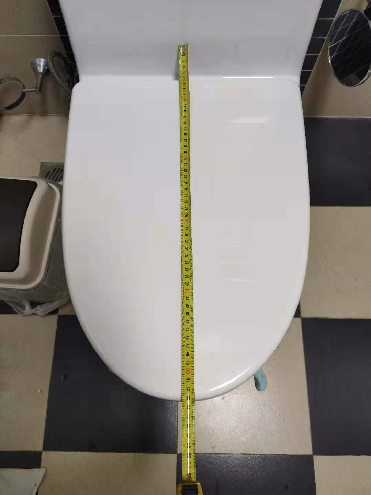
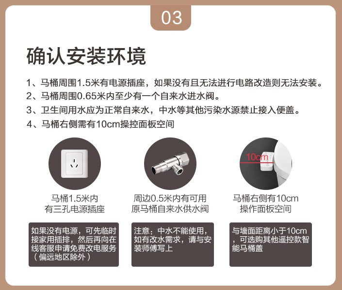

# 注意事项

选购智能马桶盖之前，有些事情要搞清楚。

## 家里的原先马桶🚽能否安装？

* 马桶🚽形状
  * 很多智能马桶盖都**不支持**`方形马桶`，其他的形状（`水箱垂直型`、`水箱微弧形`、`水箱内弧形`等）一般都支持
    * 举例
      * 
* 马桶的水箱到便器的距离：`A`
  * 一般智能马桶盖，对于**水箱到便器的前端举例**都会有一定的要求，买之前要搞清楚
    * 举例
      * 
      * [海尔V3](https://item.jd.com/27970073404.html)
        * 
          * 自己家的马桶的A的举例是：`530mm` -> 是满足要求的
            * 
* 配套环境是否满足条件
  * 一般要满足的条件
    * 周边有插座：智能马桶盖要用电
    * 周边有供水阀：用于接三通和智能马桶盖的入水管
    * 马桶右侧有点空间(10cm)：非遥控的面板一般在马桶右边
  * 举例
    * 
