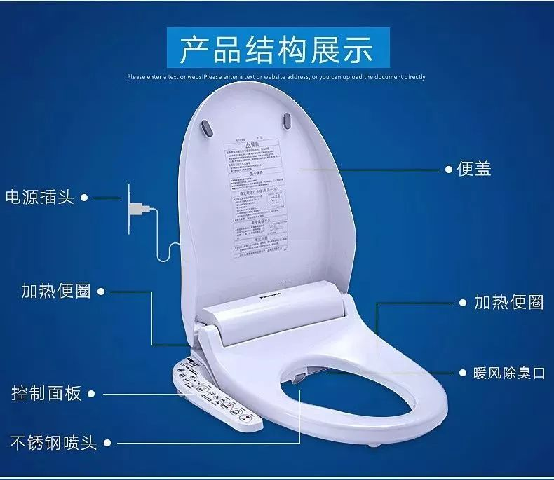
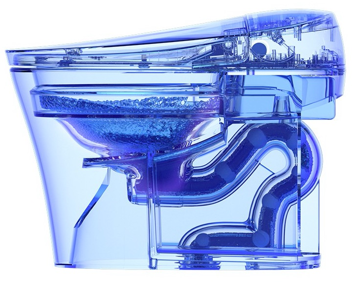
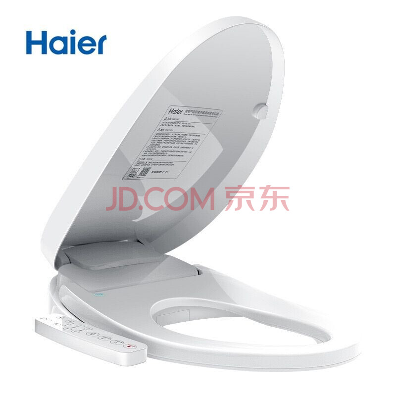
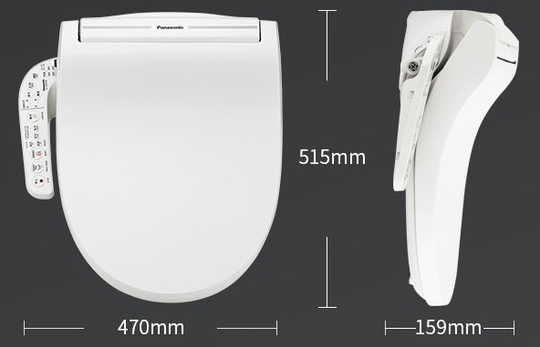
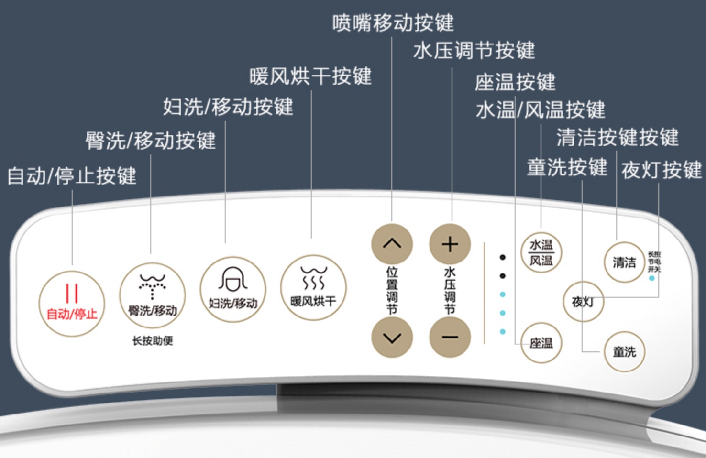
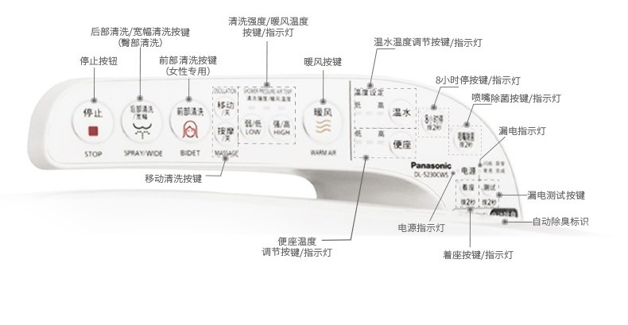
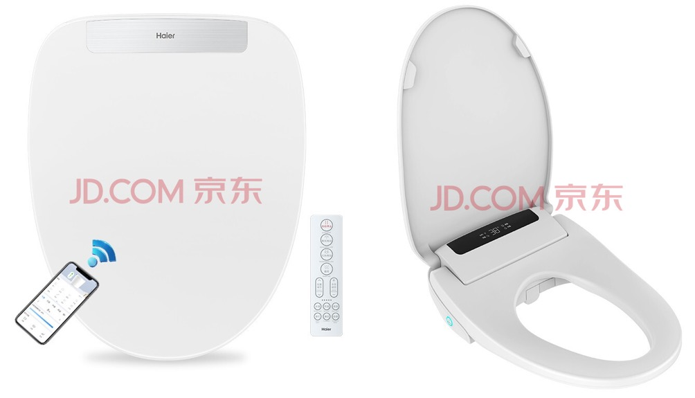
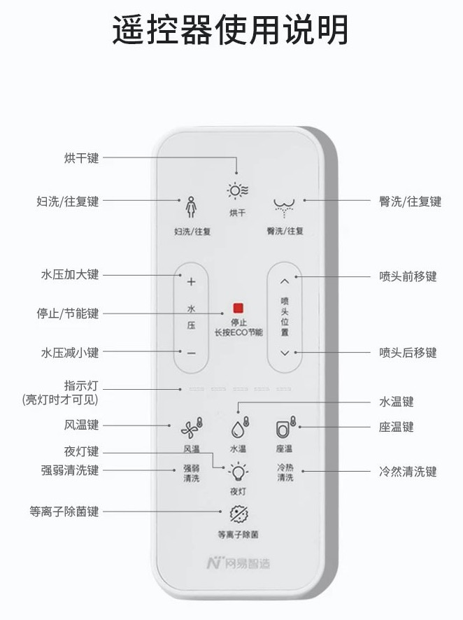
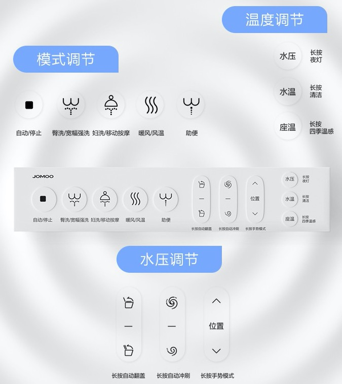
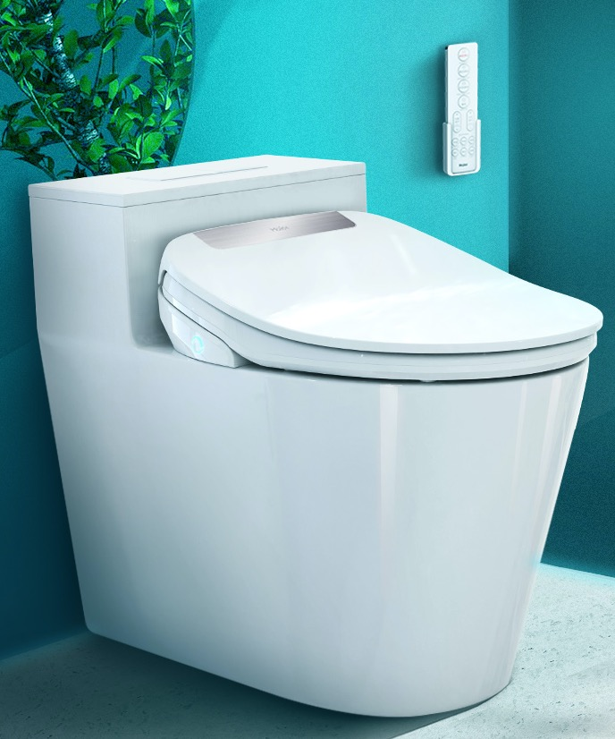

# 智能马桶盖的组成和结构

## 组成和结构

* 主要组成
  * `座圈`=`马桶盖`
  * `水件`
  * （内部）电路板
  * 电源插座
* 典型结构
  * 智能马桶盖
    * 
  * 马桶+马桶盖 透视图
    * 

## 长什么样

* 长什么样
  * 普通的、有线的 智能马桶盖
    * 
    * 
      * 控制面板
        * 
        * 
  * 无线的、遥控的 智能马桶盖
    * 
      * 控制面板 = 无线遥控器
        * 
        * 
    * -> 无线遥控器 + 智能马桶盖 已装在 普通马桶上
      * 

## 组件详解

* 详解
  * `座圈`
    * 材质
      * PVC塑料、ABS树脂、PP材料、ASA材料、亚克力、脲醛
        * 在使用寿命，光泽度、质感、耐高温能力、耐酸耐潮能力、耐磨耐划能力上，这几种材质依次递增，当然价格也是如此，它区分了智能马桶盖的档次
        * 对比：PVC < ABS < PP < ASA < 亚克力 < 脲醛 
      * 详细对比
        * `ABS`：易变黄，但抗老化好
          * 优点：硬度大，不易变形
          * 缺点：易变色，易断裂；抗老化差，耐高温性能差，耐腐蚀性差
        * `PP`：抗老化不好，但不易变色
          * 俗称：百折不断胶
          * 优点：不易变色、断裂，耐高温性能好，耐腐蚀性强
          * 缺点：硬度不够，生产难度大
        * `ABA`：不易老化、不易变黄、防静电
          * 看上去像瓷砖
      * 结论
        * 尽量选**ASA**材质
    * 工艺
      * 抗菌工艺
        * 银离子抗菌、SIAA抗菌、纳诺怡抗菌
        * 它们的抗菌能力依次增加，价格也是如此
          * 对比：银离子抗菌 < SIAA抗菌 < 纳诺怡抗菌
  * `水件`
    * 清洁系统
      * 喷嘴
        * 喷嘴材质
          * 塑料
          * 不锈钢
            * 推荐选 不锈钢
        * 喷嘴功能
          * 自洁除菌
          * 双喷嘴
            * 建议选多喷嘴=喷孔
              * 比如
                * 双喷嘴
          * 进水过滤
          * 马桶润壁
  * （内部）电路板
    * 功能
      * 防水
      * 防短路
  * 电源插座
    * 功能
      * 防漏电
