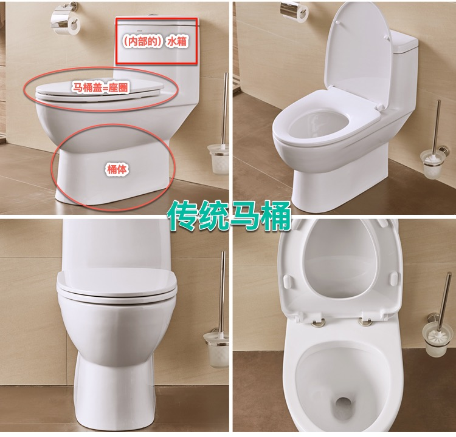
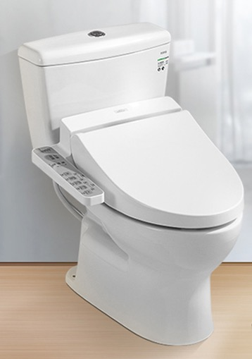
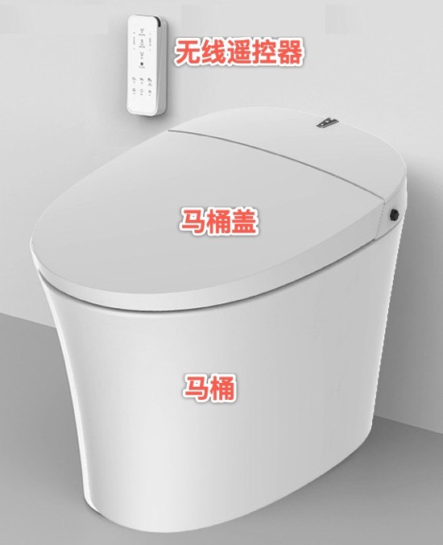
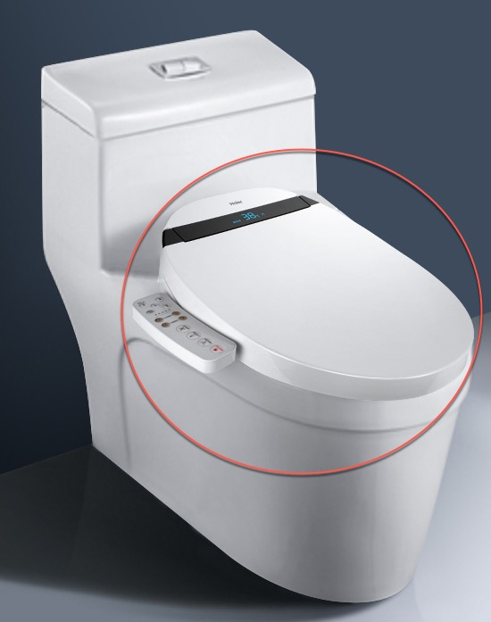
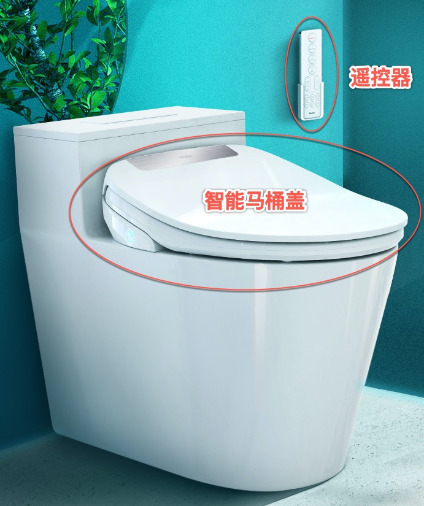

# 智能马桶盖的分类

## 背景知识

* 传统马桶 = 普通马桶
  * 主要组成
    * 三部分
      * `水箱`
      * `马桶盖`
      * `桶体`
        * 涉及到：桶体的工艺、釉面
  * 长什么样
    * 

## 智能马桶盖 vs 智能马桶

* 智能马桶盖 vs 智能马桶
  * 分类
    * 根据`智能马桶盖`是否和`马桶`连在一起
      * **一体式**=**连体式**
        * 马桶和马桶盖连在一起
          * 被叫做：智能马桶
        * 你买的就是的**带智能功能**的**一体式**的马桶
          * 当然从逻辑上说，智能部分的功能，也都还是`马桶盖`部分实现的
      * **分体式**=**分离式**
        * `马桶`和`马桶盖`是分开的
          * 是最常见的情况
            * 你家已买了普通的`马桶`
              * 然后再去单独买个智能马桶盖
    * 根据`智能马桶盖`的`控制面板`，是否和`智能马桶盖`连在一起
      * **有线**（控制面板）
      * **无线**（控制面板）=`无线`（遥控器）
  * 长什么样
    * 一体式
      * **智能马桶**
        * `有线`
          * 
        * `无线`=`遥控`
          * 
    * 分离式
      * **智能马桶盖**
        * `有线`
          * 
        * `无线`=`遥控`
          * 
